# Snake Game 🐍

## Estrutura inicial

Para o desenvolvimento deste game começarei com a seguinte estrutura:

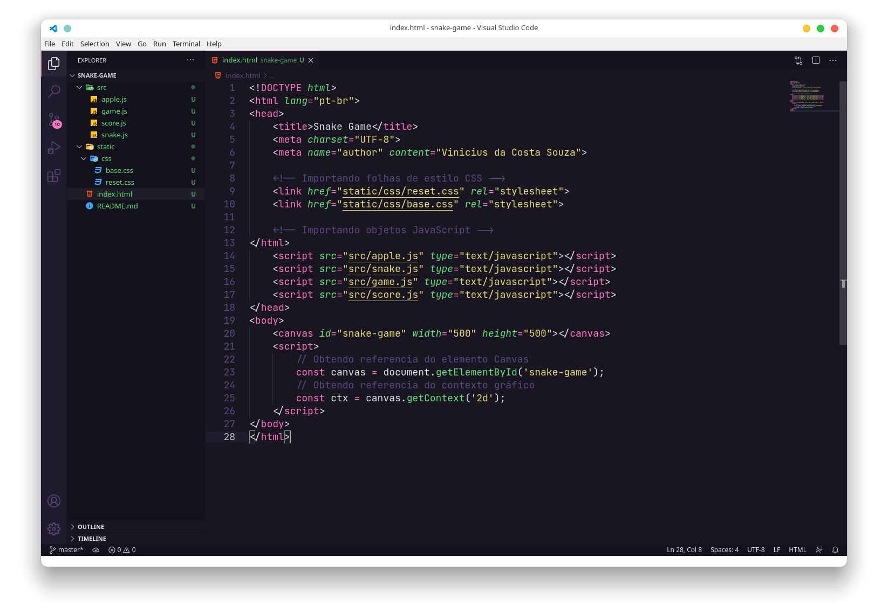

A ideia é separar os objetos JavaScript e folhas de estilo CSS. Ainda que o jogo seja bem simples acredito que é uma boa prática essa separação, portanto não poderia perder a oportunidade de exercitar!

## Canvas e o contexto gráfico
#### O Canvas
O elemento ```<canvas>``` foi criado com os atributos **width** e **height** (largura e altura respectivamente) e o id **snake-game**. O id é muito importante pois é através dele que o JavaScript localizará a referência ao elemento ```<canvas>``` que será manipulado.

O Canvas possui o seguinte sistema de coordenadas:

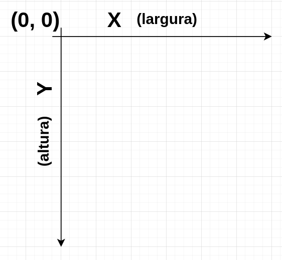

No canto superior esquerdo as coordenadas são (0,0).

#### Contexto gráfico
Para começar a desenhar é preciso utilizar referência do elemento HTML ```<canvas>```, que ficará armazenada em uma constante, e obter o seu contexto gráfico.
```JavaScript
    const canvas = document.getElementById('snake_game_canvas');
    const ctx = canvas.getContext('2d')
```
O contexto gráfico é um objeto da interface CanvasRenderingContext2D, é nele que desenhamos o que será exibido no elemento ```<canvas>```.

Abrindo o arquivo index.html (já estilizado) temos o seguinte:

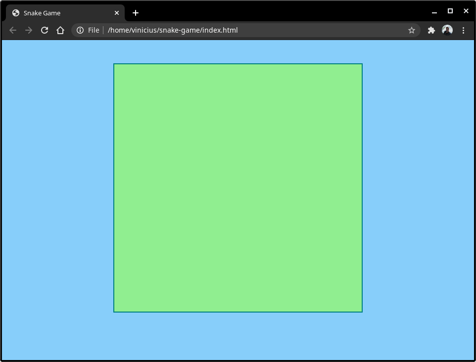

Está concluído o ponto de partida do game.

## O jogo

O jogo da cobrinha é bastante simples, a base do jogo é construída com apenas três objetos:

* 🔳 Área do jogo
* 🐍 Cobra
* 🍎 Maçã

A regra também é bastante simples, o jogador apens escolhe a direção que a cobra se movimenta com o objetivo de comer as maçãs. As maçãs aperecem em lugares aleatórios e cada vez que a cobra come uma maçã ela aumenta seu próprio comprimento. Se a cabeça da cobra colidir com a sua cauda o jogo é finalizado.

## 🔳 Área do jogo

O primeiro passo é definir o tamanho dos **tiles**. Com base na área do ```<canvas>``` que é de 500px x 500px vou definir cada **tile** com a dimensão de 10px.

No arquivo src/game.js inicio o objeto **game**:

```JavaScript
    let game = {
        tile : 10,
    }
```
E já faço o primeiro teste desenhando um tile na tela, para isso basta adicionar os seguintes comandos entre as tags ```<script></script>``` no corpo do documento html:

```html
    ctx.fillStyle = "tomato"
    ctx.fillRect(10, 10, game.tile, game.tile)
```

O resultado é esse primeiro quadrado com as dimensões de 10px x 10px nas coordenadas (10,10) do Canvas.

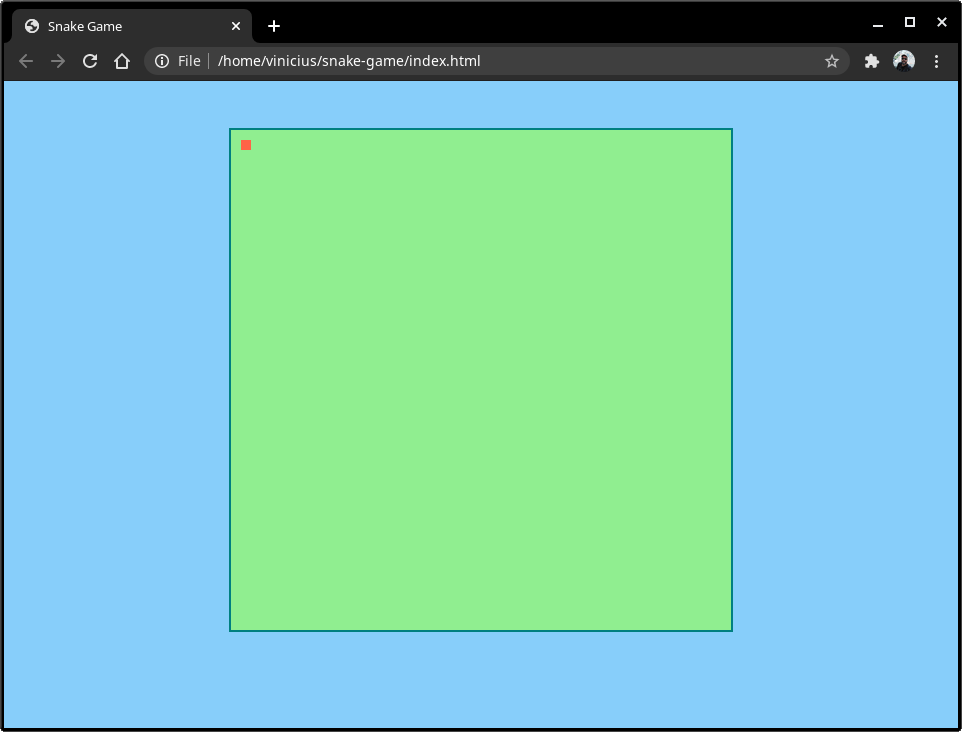

Esse foi apenas um teste para ver como as coisas estão indo. Começarei agora a definir o próximo objeto 🐍.

## 🐍 Cobra

A cobrinha é o objeto com mais atributos neste jogo. Definirei os atributos **color**, **body**, **size**, **positionX**, **positionY**, **direction** e **velocity**.

No arquivo src/snake.js inicio o objeto **snake**`:

```JavaScript
    let snake = {
        color : "DarkGreen",
        body : [],
        size : 3,
        positionX : 10,
        positionY : 10,
        direction : "right",
        velocity : 120,
    };
```

O primeiro atributo é a cor da cobrinha, logo após declaro um array vazio para o corpo, em seguida o comprimento, também adiciono as coordenadas iniciais, direção que a cobrinha se moverá e sua velocidade.

Foi necessário utilizar um array para o corpo da cobrinha pois ele nada mais é que um vetor de coordenadas (x,y) onde cada posição representa um bloco. A cada maça comida uma nova posição será adicionada ao final desse array.

Esses sãos os atributos da cobrinha.

## Funções do jogo

Criarei agora 2 funções que serão muito importantes, primeiro a função **moveSnake()** que irá alterar as posições x ou y no objeto **snake**, incrementando ou decrementando um **game.tile** conforme o valor em **snake.direction**.

A lógica é a seguinte:

* Se a direção for esquerda: subtraia um valor de x
* Se a direção for cima: subtraia um valor de y
* Se a direção for direita: some um valor a x
* Se a direção for baixo: some um valor a y;

A função **moveSnake()** ficará assim:

```JavaScript
    function moveSnake(){
        switch(snake.direction){
            case "left":
            snake.positionX -= game.tile;
            drawSnake();
            break;

            case "up":
            snake.positionY -= game.tile;
            drawSnake();
            break;

            case "right":
            snake.positionX += game.tile;
            drawSnake();
            break;

            case "down":
            snake.positionY += game.tile;
            drawSnake();
            break;
        };
    };
```

Reparem que existe uma chamada da função **drawSnake()** que será definida agora:

```JavaScript
    function drawSnake(){
        snake.body.push([snake.positionX, snake.positionY])
        ctx.fillStyle = snake.color;
        ctx.fillRect(snake.positionX, snake.positionY, game.tile, game.tile);
    };
```

A função **drawSnake()** adiciona o valores atuais (já incrementado/decrementado na função **moveSnake()**), altera a cor no contexto gráfico conforme valor no atributo **snake.color** e desenha em **snake.positionX** e **snake.positionY**.

#### Hora de testar

Para testar vou utilizar o método **setInterval()** passando a função **moveSnake** como argumento e **snake.velocity** como o intervalo em milisegundos.

Voilà!!!

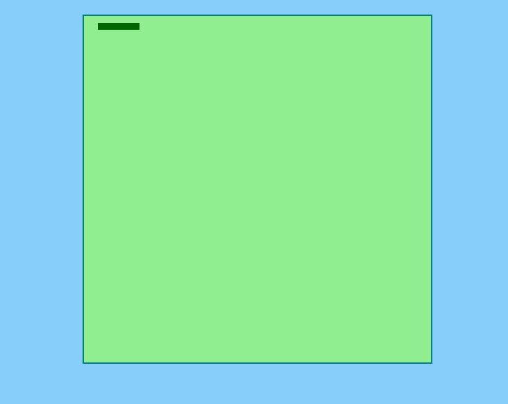

No **index.html** ficou assim:

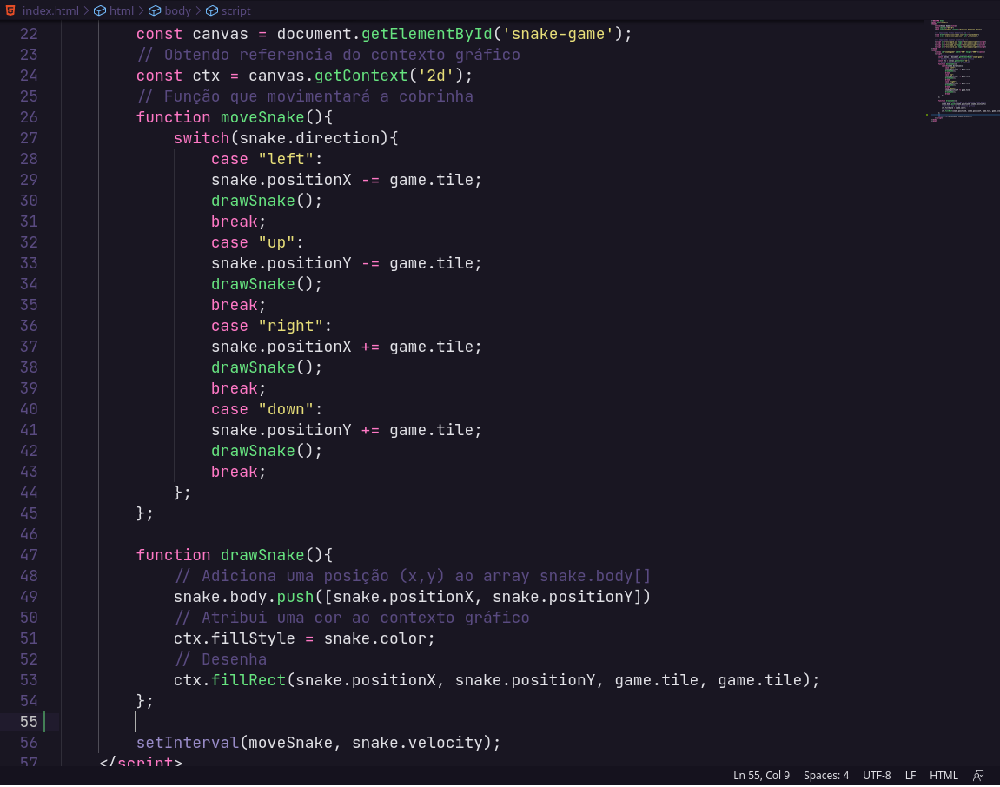

## 🕹️ Controles

Preciso agora definir uma função que a cada vez que o jogador pressionar alguma das setas no teclado, a cobrinha mude a sua direção. A função é bastante simples:

```JavaScript
    document.onkeydown = function(event){

        switch(event.keyCode){
            case 37:
            snake.direction = "left";
            break;

            case 38:
            snake.direction = "up";
            break;

            case 39:
            snake.direction = "right";
            break;

            case 40:
            snake.direction = "down";
            break;

            default: break;
        };
    };
```
Vinculamos a função ao evento **onkeydown** no documento index.html e passamos o evento como argumento da função. Sempre que o usário teclar verificaremos o KeyCode da tecla digitada e se for caso (KeyCode das setas 37, 38, 39 e 40) o atributo **snake.direction** será alterado.

Vamos testar para ver se está funcionando:


Agora a cobrinha já está mudando a direção!

## Ajustando o desenho da cobrinha

É necessário ajustar o tamanho do desenho da cobrinha ao atributo **snake.size**, faremos isso atualizando a função **drawSnake()**:

```JavaScript
    function drawSnake(){
        snake.body.push([snake.positionX, snake.positionY])
        ctx.fillStyle = snake.color;
        ctx.fillRect(snake.positionX, snake.positionY, game.tile, game.tile);

        if(snake.body.length > snake.size){
            let [removeX, removeY] = snake.body.shift();
            ctx.clearRect(removeX, removeY, game.tile, game.tile);
        };
    };
```

Basta adicionar um bloco de estrutura condicional que verifique se o tamanho do array **snake.body** é maior que o atributo **snake.size**, se isso for verdadeiro apagamos um **game.tile** na coordenada (x,y).
Obtemos essas coordenadas por meio da desestruturação do retorno do método **shift()** e então limpamos o desenho naquela posição.

O resultado é o seguinte:

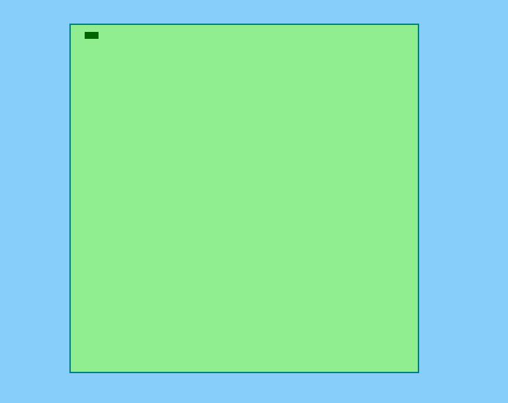


## Precisamos das maçãs 🍎

Agora é a vez de desenhar as maçãs no jogo. A lógica é bem simples, basta definir um valor aleatório para as coordenadas (x,y) e desenhar na tela:

```JavaScript
    function drawApple(){
        apple.positionX = Math.floor(Math.random() * (canvas.width/game.tile) * game.tile);
        apple.positionY = Math.floor(Math.random() * (canvas.width/game.tile) * game.tile);
        ctx.fillStyle = apple.color;
        ctx.fillRect(apple.positionX, apple.positionY, game.tile, game.tile);
    };
```

Para testar o código invoco a função...

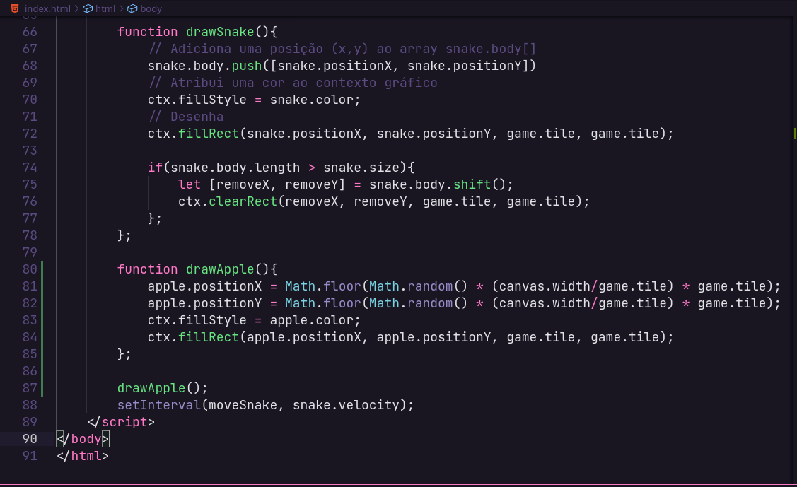

E observo o resultado (estou pressionando F5 para recarregar a página):

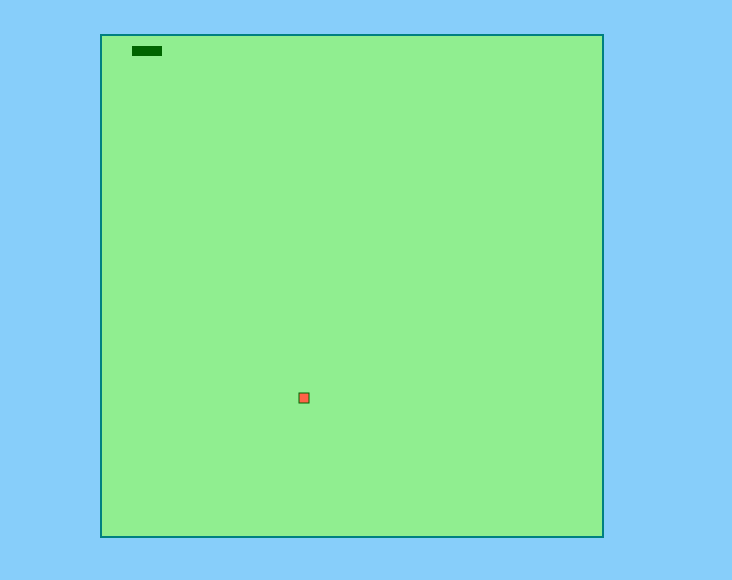


## Ensinando a cobrinha a comer as maçãs

Vamos criar um função que irá checar se houve colisão entre dois retângulos, primeiro vou testar a colisão com a maçã e caso aconteça o atributo **snake.size** será incrementado em 1 unidade, o desenho da maçã apagado e uma nova maçã será desenhada aleatoriamente.

```JavaScript
    function snakeCollided(){
        if(snake.positionX < apple.positionX + game.tile &&
            snake.positionX + game.tile > apple.positionX &&
            snake.positionY < apple.positionY + game.tile &&
            snake.positionY + game.tile > apple.positionY)
            {
            snake.size += 1;
            ctx.clearRect(apple.positionX, apple.positionY, game.tile, game.tile);
            drawApple();
            };
    };
```
Essa função será invocada dentro da função **drawSnake()**:

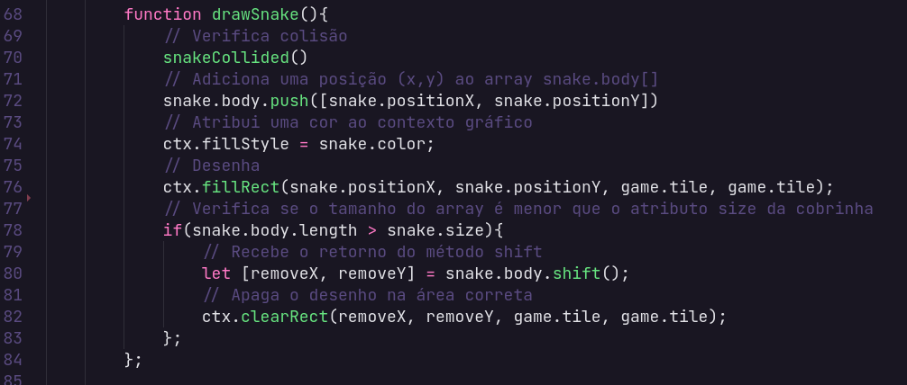

Conferindo o resultado:

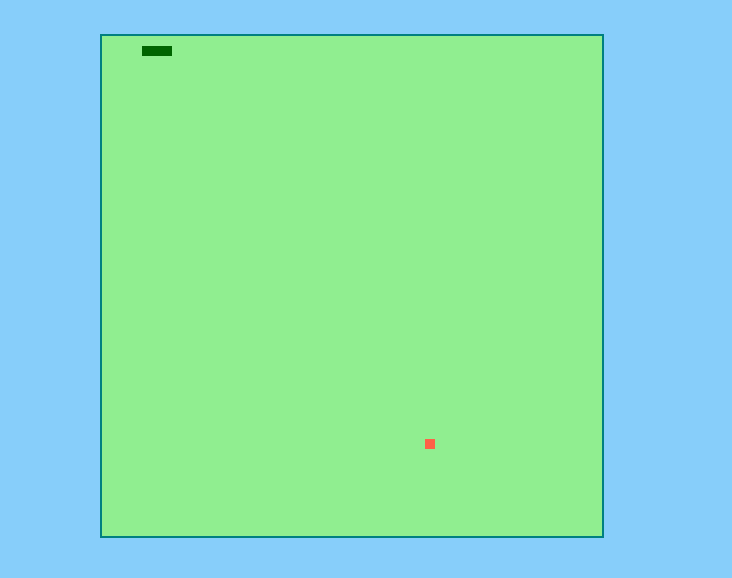

Funcionou! 🤓🕹️

## Problemas

O tamanho de 10 pixels definido para o **game.tile** é muito pequeno o que torna a evolução no game muito lenta. Vou alterar para 20 pixels. É só alterar o valor no arquivo **src/game.js**

```JavaScript
let game = {
    tile : 20,
};

```

Outro problema é a velocida que está bem lenta. Vou alterar o atributo **snake.velocity** para 60 milisegundos.

```JavaScript
let snake = {
    color : "DarkGreen",
    body : [],
    size : 3,
    positionX : 10,
    positionY : 10,
    direction : "right",
    velocity : 60,
};
```
Agora ficou bem mais desafiador! Haha

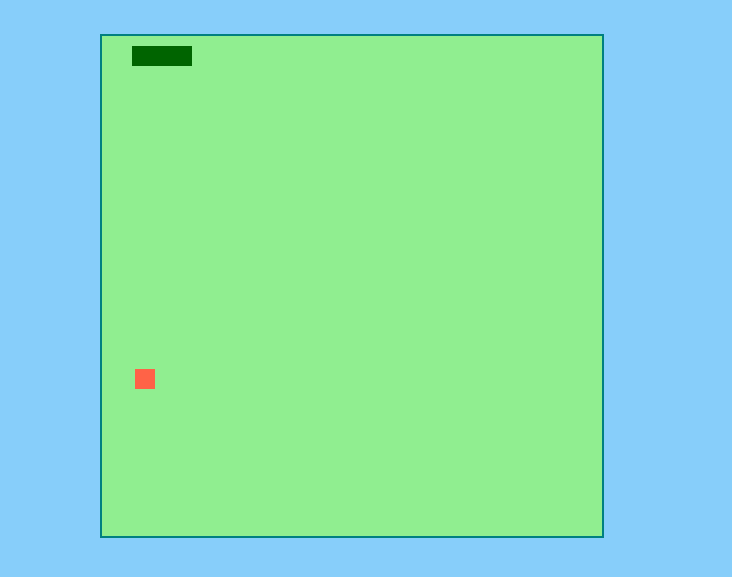


## Novas maçãs 🍎

Precisamos de maçãs de verdade! Para isso vou adicionar ao projeto a pasta **static/images/** e dentro dela ficará salvo o arquivo de imagem **apple.png**.

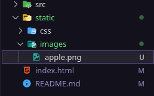

Imagem **apple.png**:


No objeto **src/apple.js** adiciono o atributo **image** nele ficará o caminho para a imagem **apple.png**:

```JavaScript
let apple = {
    color : "tomato",
    positionX : 200,
    positionY : 250,
    image : "./static/images/apple.png"
}
```

No **index.html**, entre as tags ```<script></script>```, instancio um objeto do tipo **Image** e crio uma função que irá desenhar essa imagem na tela assim que o evento **image_apple.onload** for disparado:

```JavaScript
        const image_apple = new Image();
        image_apple.src = apple.image;

        image_apple.onload = function(){
            apple.positionX = Math.floor(Math.random() * (canvas.width - game.tile));
            apple.positionY = Math.floor(Math.random() * (canvas.width - game.tile));
            ctx.drawImage(image_apple, apple.positionX, apple.positionY, game.tile, game.tile);
        };
```

E na função **drawApple()** substituo o metódo que desenhava os retângulos por: ```ctx.drawImage(image_apple, apple.positionX, apple.positionY, game.tile, game.tile)```. A partir de agora a imagem da maçã será carregada ao invés do desenho do retângulo vermelho.

Testando...

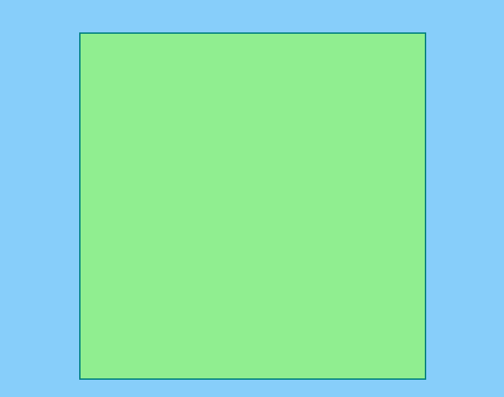

Se você prestou atenção, no código anterior eu fiz um update na criação dos números aleatórios para as coordenadas das maçãs. Mas isso não é suficiente, vou criar a função **randomCoordinate()** que ficará responsável por gerar as coordenadas (x,y) aleatoriamente.

```JavaScript

        function randomCoordinate(){
            let coordinateX = Math.floor(Math.random() * (canvas.width - game.tile));
            let coordinateY = Math.floor(Math.random() * (canvas.height - game.tile));
            return [ coordinateX, coordinateY ];
        };

        function drawApple(){
            [ apple.positionX, apple.positionY ] = randomCoordinate();
            ctx.drawImage(image_apple, apple.positionX, apple.positionY, game.tile, game.tile);
        };

        image_apple.onload = function(){
            [ apple.positionX, apple.positionY ] = randomCoordinate();
            ctx.drawImage(image_apple, apple.positionX, apple.positionY, game.tile, game.tile);
        };
```

Ficou bem melhor agora. Acredito que em relação a maçã não há nada mais a ser feito ✅🍎.

## Refatorar colisões

Hora de verificar se a cobrinha colidiu com ela mesmo, se isso ocorrer a partida deverá terminar. Então vou refatorar a função **snakeCollided()** dessa maneira:

```JavaScript
        function snakeCollided(){
            // Verifica se comeu a maçã
            if(snake.positionX < apple.positionX + game.tile &&
               snake.positionX + game.tile > apple.positionX &&
               snake.positionY < apple.positionY + game.tile &&
               snake.positionY + game.tile > apple.positionY)
               {
                snake.size += 1;
                ctx.clearRect(apple.positionX, apple.positionY, game.tile, game.tile);
                ctx.fill();
                drawApple();
            };
            // Retorna a posição atual (x, y)
            let has_snake = element => element[0] == snake.positionX && element[1] == snake.positionY
            // Verifica no array já existe a posição atual.
            if(snake.body.some(has_snake)){
                console.log("Se comeu 🐍");
            };
        };
```

Adicionei ao final a variável **has_snake** que armazenará a posição atual da cobrinha e logo após verifico se aquela posição já existe no array **snake.body**. Se essa condição for verdadeira o console deverá exibir a mensagem.

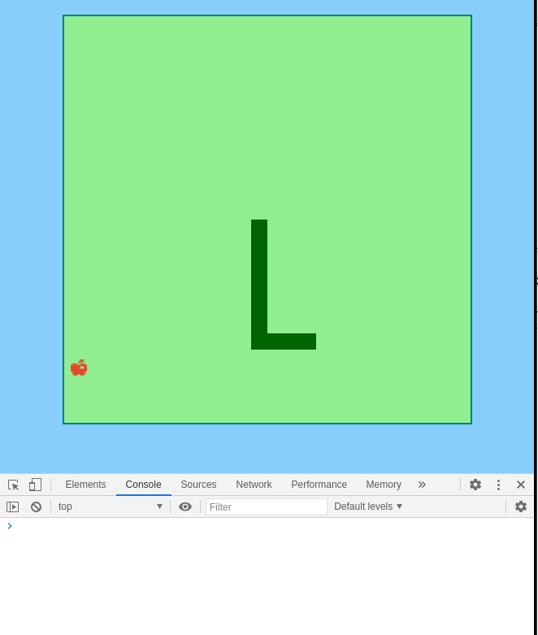

Funcionou, o console exibiu a mensagem **"Se comeu 🐍"** todas as vezes que a cobrinha colidiu com ela mesmo.

Agora falta definir as colisões com as paredes adicionando outro bloco condicional que checará se as coordenadas atuais (x,y) da cobrinha ultrapassaram os limites do Canvas:

```JavaScript
        function snakeCollided(){
            // Verifica se comeu a maçã
            if(snake.positionX < apple.positionX + game.tile &&
               snake.positionX + game.tile > apple.positionX &&
               snake.positionY < apple.positionY + game.tile &&
               snake.positionY + game.tile > apple.positionY)
               {
                snake.size += 1;
                ctx.clearRect(apple.positionX, apple.positionY, game.tile, game.tile);
                ctx.fill();
                drawApple();
            };
            // Retorna a posição atual (x, y)
            let has_snake = element => element[0] == snake.positionX && element[1] == snake.positionY
            // Verifica no array já existe a posição atual.
            if(snake.body.some(has_snake)){
                console.log("Se comeu 🐍");
            };
        };
            // Verifica se ultrapassou limites do Canvas
            if(snake.positionX < 0 - (game.tile/2) ||
               snake.positionX > canvas.width + (game.tile/2) ||
               snake.positionY < 0 - (game.tile/2) ||
               snake.positionY > canvas.height + (game.tile/2) ){
                   console.log("⛔ Ultrapassou a tela!!");
               };
```
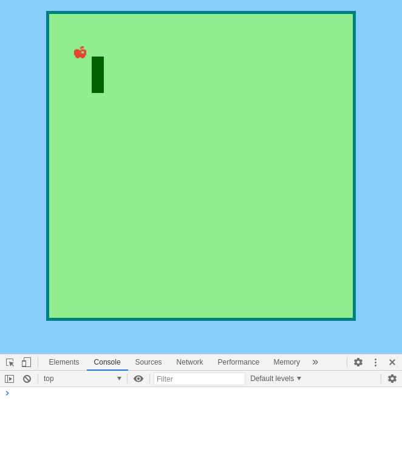

Pronto! Funcionou! 

## Score

## Game Over

## Menu